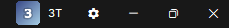
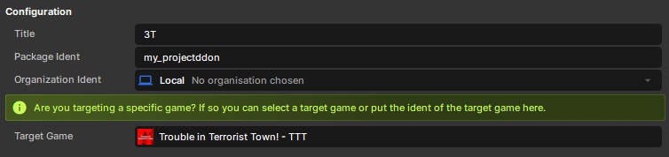
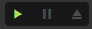
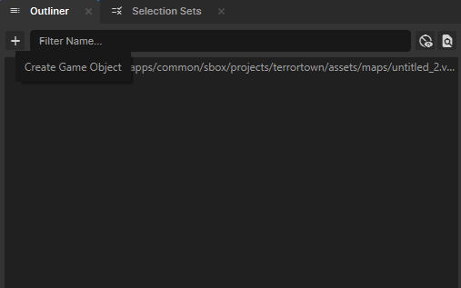
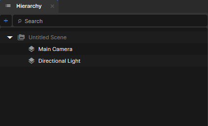

---
title: Basics
icon: material/hammer
---

# :material-hammer: Basics

<strong>You can make a great TTT map without being an expert</strong>

Some of the most popular and enjoyable maps this gamemode has ever seen over the last 20 years were made as someone's first map. Good maps are not exclusively complex or challenging to make. Great layouts & the map playfund on s&box are both well within in reach, even if it's your first time making a map for TTT, s&box or just the first time, period. 

The baseline requirements for TTT are simple: [Spawns](spawns.md). That's it. The aim of these tools is to make things as easy as possible to set up, but offer loads and loads of fun logic to add in if desired. 

Here, we'll go over the basics of getting started on a map.

## :material-folder-plus: Project Creation

To have access to the components TTT uses and to test out your game locally in TTT, you need to target the game.

1.  Click the cog wheel on the top right of your main editor window.

    { .img-frame .img-compact loading=lazy }

2.  Search under **Target Game** for TTT.

    { .img-frame .img-compact loading=lazy }

3.  Restart the editor when prompted. Once it reopens, you'll have access to all of the various components & tools from TTT.

---

## :material-play-box: Editor Testing

=== ":fontawesome-solid-hammer: Hammer"
    To test a Hammer map, create a scene and add our `MapLoader` component to a new GameObject in the scene. Make sure the map has been compiled, then assign the compiled `.vmap` to the map instance.
    !!! warning ""
        Make sure 'Load in engine after building' is unchecked or it will boot to the TTT menu in-editor when the compile is done.

=== ":material-movie-open-star: Scene"
    { .img-frame .img-compact loading=lazy align=left }
    To test a scene map, simply click the play icon with the scene open.

    

---

## :material-cube-outline: Adding a GameObject

=== ":fontawesome-solid-hammer: Hammer"
    Click the + icon in the outliner and choose empty or an existing object from the drop-down.
    { .img-frame .img-compact loading=lazy } 

=== ":material-movie-open-star: Scene"
    Click the + icon in the hierarchy and choose empty or an existing object from the drop-down, or right-click in the empty area and choose "Create".
    { .img-frame .img-compact loading=lazy align=left }

!!! note "Networking"
    If you feel compelled to change the network behavior of a GameObject, you usually don't need to and shouldn't. Changes here can break or partially break the object functionally. This is handled during the map bootstrap process in-game, so unless you have other games which demand they be authored a particular way, leave them as the default (`Networkmode.Snapshot`). 

---

## :material-upload: Publishing

Before uploading a map package:

=== ":fontawesome-solid-hammer: Hammer"
    - Final compile the map.
    - Keep the `.vmap` name under 32 characters & avoid spaces or symbols in the map file name.
    - Make the package public if players need to discover and download it.

=== ":material-movie-open-star: Scene"
    [Publishing a Scene Map](https://sbox.game/learn/facepunch/map-publish)

