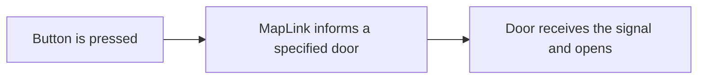

---
title: I/O
icon: material/source-branch
---

# :material-source-branch: I/O

## :material-book-open-variant: Basics

I/O is short for **Input/Output**. TTT's mapping tools use I/O to let one object tell another object to do something. A button can open a door, a trigger can start a trap, a tester can turn on a light, and a counter can wait for several events before firing its own output.

A simple example is a button sending an output to a door, which opens it.

The sender owns the output list. Each entry in that list is a `MapLink`. The `MapLink` decides which receiver gets the signal, which input name is sent, whether there is a delay, and whether any extra payload text is included.

---

## :material-table: MapLink Fields

| Field | What it does | Usual advice |
| --- | --- | --- |
| `Target` | Direct component reference. | Best for scene-authored maps when direct references are easy to assign. Leave `Input` blank for common one-to-one wiring. |
| `TargetName` | Finds every GameObject with this name. Matching is case-insensitive and trims whitespace. | Useful for Hammer-style authoring and readable wiring. Use stable, intentional names. |
| `TargetTag` | Sends the signal to every GameObject with this tag. | Useful for one-to-many events, such as enabling several lights at once. |
| `Input` | Optional command override sent to the receiver. | Leave blank unless you need a specific command such as `Open`, `Close`, `Toggle`, `Start`, `Stop`, `GoTo`, `Lock`, or `Unlock`. |
| `Delay Seconds` | Optional delay before the signal is delivered. | Use for small scripted sequences. Keep it blank or `0` for immediate behavior. |
| `Payload` | Optional extra text value sent with the input. | Leave blank unless the receiver specifically needs authored data, such as a path point name for `GoTo`. |

---

## :material-target: Targeting Modes

### :material-crosshairs-gps: Direct Target

Use `Target` when you can comfortably drag or assign the receiving component in the scene editor. This is the cleanest one-to-one setup because it points at the exact component that should receive the signal.

!!! tip "Blank Input"
    Direct targets also have a helpful fallback: if `Input` is blank and the receiver rejects the forwarded signal, TTT tries `Activate` for that direct component. This is why many scene-authored links work correctly with a blank `Input`, because most objects take `Activate` to mean "do what I usually do".

### :material-form-textbox: Target Name

Use `TargetName` when direct references are inconvenient or when the map is coming from Hammer. In Hammer, assigning direct component references can be awkward or unreliable depending on the interface and authoring path, so name-based wiring is expected and supported.

Name targeting finds matching GameObjects, then sends the signal to I/O receivers under those objects. This does not get the same direct-component `Activate` fallback. If a blank `Input` forwards a signal the receiver does not accept, the named receiver may do nothing. For Hammer-style name links, be more willing to set `Input` explicitly.

### :material-tag: Target Tag

Use `TargetTag` when one output should affect a group. For example, a single trigger might turn on every object tagged `tester_light`.

Like name targeting, tag targeting does not get the direct-component `Activate` fallback. Set `Input` when the group needs a specific command.

---

## :material-keyboard: Inputs

A blank `Input` is usually correct. It forwards the sender's current signal, and many outputs already send the most useful default signal for their purpose. For example, a normal button press sends an activation-style signal that most receivers understand.

Set `Input` only when you want to command the receiver more precisely.

| Input | Common use |
| --- | --- |
| `Activate` | Generic default action. Good for simple receivers and one-shot effects. |
| `Open` / `Close` | Door-shaped commands. These are treated like `Start` / `Stop` by many stateful tools. |
| `Start` / `Stop` | Generic on/off or positive/negative state commands. Good for movers, enable targets, and toggle-style setups. |
| `Toggle` | Flip the receiver between its states. |
| `Lock` / `Unlock` | Prevent or restore use during the round. |
| `Reset` | Return a compatible receiver to its authored baseline. |
| `GoTo` | Send a path mover to a named or numbered path point. Usually needs `Payload`. |
| `CallOrDepart` | Call a path mover to a point, or send it away if it is already there. Usually needs `Payload`. |
| `Next` / `Previous` | Move a path mover to a neighboring point. |
| `Pause` / `Resume` | Temporarily stop and continue compatible path movement. |
| `Reverse` | Reverse compatible path movement. |

Trigger-style outputs can also send occupancy signals such as `Enter`, `Exit`, `Occupied`, and `Empty`. Role tester outputs can send `Pass` and `Fail`. Most maps should not type those manually unless a specific tool page tells you to.

---

## :material-message-text: Payloads

Most links should leave `Payload` blank. Payloads are for receivers that need a value in addition to the input name.

Common payload uses:

| Input | Payload example | Meaning |
| --- | --- | --- |
| `GoTo` | `floor_2` | Move a path mover to the path point named `floor_2`. |
| `CallOrDepart` | `lobby` | Call a mover to `lobby`, or depart from it if already there. |
| Counter inputs | `2` | Add or subtract an explicit amount when the counter supports it. |

If you are not sure whether a payload is needed, leave it blank first and check the specific tool page.

---

## :material-timer-outline: Delays

`Delay Seconds` on a `MapLink` delays only that link. This is useful when one output should fire several receivers in sequence.

Some tools also have their own timing fields, such as a button's fire delay or a mover's travel duration. Tool timing controls when the sender decides to fire. Link delay controls when a specific receiver receives the signal after the sender fires.

---

## :material-check-circle: Good Practice

Leave `Input` blank for normal direct links until you have a reason to specify it. This keeps the setup receiver-centered and avoids accidentally forcing the wrong command. It's also just easier.

Use explicit inputs when:

- Links using the **`GameObject`'s name** or **tags** needs a receiver to do something specific.
- A path mover needs `GoTo`, `CallOrDepart`, `Next`, or `Previous` Elevators often require inputs for full functionality.
- A door must only `Open` or only `Close`, or a toggle button needs separate `Start` and `Stop` behavior, for example.
- You are locking or unlocking something.

Prefer one targeting mode per link. Use `Target`, `TargetName`, or `TargetTag` intentionally; filling several target fields at once can send the same output farther than expected.

Use stable object names for name targeting. Names like `door_traitor_room`, `tester_light_green`, and `elevator_platform` are easier to debug than generic names like `Door` or `GameObject`.

Test I/O after a round reset. TTT map tools are expected to return to their authored baseline between rounds, and reset behavior is part of the setup.

---

## :material-shape-plus: Common Patterns

### :material-door-sliding: Button opens a sliding door

1. Add `TTT Linear Mover` to the door object.
2. Set the movement delta and timing.
3. Add `TTT Button` to the button object.
4. Add a link on `Targets On Pressed`.
5. For direct scene wiring, assign `Target` to the mover and try leaving `Input` blank.
6. For Hammer/name wiring, set `TargetName` to the door object's name and set `Input` to `Open` if blank input does not open it.

### :material-account-key: Role button activates a trap

1. Add `TTT Role Button`.
2. Set the required role, such as `Traitor`.
3. Link `Targets On Activated` to a receiver such as `TTT Trigger Hurt`, `TTT Enable Target`, `TTT Explosion Target`, or a mover.
4. Leave `Input` blank for a generic activation, or set a specific command when needed.
5. Test as both an allowed role and a blocked role.

### :material-lightbulb-on: Trigger turns on a light

1. Add `TTT Enable Target` to the light, sound, particle, component, or object group you want to control.
2. Add `TTT Trigger Box` to the trigger volume.
3. Link the trigger's enter or occupied output to the enable target.
4. Use `Input = Start` to force on, `Input = Stop` to force off, or `Input = Toggle` to flip state.

---

## :material-bug: Debug Checklist

- Check spelling on target names, target tags, input names, and payload values.
- Confirm the sender output is the one being fired.
- If a direct link works but a name link does not, try setting `Input` explicitly.
- If a path command does nothing, check the payload path point name or index.
- Avoid setting all target fields at once unless you intentionally want multiple lookup modes.
- Test a full round reset after the interaction works once.
- Test as a client if the interaction is player-facing.
