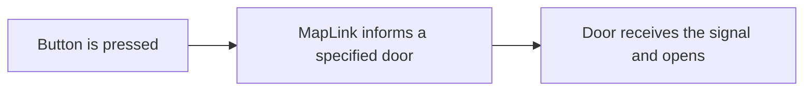

# I/O Logic

## Basics

I/O is short for **Input/Output**. TTT offers a robust I/O system that most objects are compatible with, allowing you to wire unique and interesting behavior interactions for your map. 

A simple example is a button sending an output to a door, which opens it.

### Setup

### Map link fields

| Field | What it does | When to use it |
| --- | --- | --- |
| `Target` | Direct component reference. | Best for scene-authored maps when direct references are easy to assign. |
| `TargetName` | Finds GameObjects by name. Matching is case-insensitive and trims whitespace. | Useful for Hammer-style authoring and readable wiring. |
| `TargetTag` | Sends the signal to every GameObject with the authored tag. | Useful for broad one-to-many events. |
| `Input` | The receiver action to call. | Use names such as `Open`, `Close`, `Toggle`, `Start`, `Stop`, `Lock`, or `Unlock`. |
| `Payload` | Optional extra value for the input. | Useful for path point names, custom states, or tool-specific values. |

## Common patterns

### Button opens a sliding door

1. Add `TTT Linear Mover` to the door object.
2. Set the movement delta and timing.
3. Name the door object, for example `door_secret`.
4. Add `TTT Button` to the button object.
5. Add a map link on the button output with `TargetName = door_secret` and `Input = Open`.

### Role button activates a trap

1. Add `TTT Role Button`.
2. Set the required role, such as `Traitor`.
3. Link its activation output to a receiver such as `TTT Trigger Hurt`, `TTT Enable Target`, or a mover.
4. Test both the allowed role and a blocked role.

### Trigger turns on a light

1. Add `TTT Enable Target` to the light or light controller.
2. Add `TTT Trigger Box` to the trigger volume.
3. Link the trigger's enter output to the enable target with `Input = Enable` or `Input = Toggle`.

## Debug checklist

- Check spelling on target names and input names.
- Confirm the sender output is the one being fired.
- Avoid setting all target fields at once unless you intentionally want multiple receiver lookup modes.
- Test a full round reset after the interaction works once.
- Test as a client if the interaction is player-facing.
