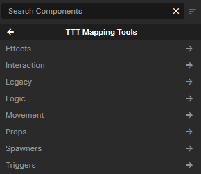

# Tools

To author any kind of tool, start by [placing a GameObject into the scene](../basics/index.md#adding-a-gameobject).

!!! info "Mapping tool components"
    

    
    
Add the component you want either by searching for it by name or selecting it from the `TTT Mapping Tools` category in the dropdown list. Some components are meant to be placed directly, while others are support pieces used by another tool.

    

## Current Tool Pages

-   __[:material-cursor-default-click:{ .lg .middle } Buttons and Role Buttons](buttons.md)__

    ---

    Player-use buttons, role-gated trap buttons, and button outputs
    
-   __[:material-badge-account:{ .lg .middle } Role Testers](role-testers.md)__

    ---

    Trigger volumes that check roles and drive tester indicators

-   __[:material-source-branch:{ .lg .middle } State and Logic](state-and-logic.md)__

    ---

    Enable targets, disable targets, and count repeated signals

-   __[:material-door-open:{ .lg .middle } Doors](doors.md)__

    ---

    Rotating doors, sliding doors, door inputs, and double-door patterns

-   __[:material-swap-vertical:{ .lg .middle } Linear Movers](linear-movers.md)__

    ---

    Two-position movers for panels, shutters, lifts, gates, and traps

-   __[:material-elevator:{ .lg .middle } Elevators and Path Movers](elevators.md)__

    ---

    Path tracks, path points, elevators, call buttons, and moving platforms

-   __[:material-slide:{ .lg .middle } Ziplines and Slides](ziplines-and-slides.md)__

    ---

    Player ride paths for ziplines, slides, and guided traversal

-   __[:material-select-all:{ .lg .middle } Triggers](triggers.md)__

    ---

    Trigger boxes, teleport volumes, and push volumes

-   __[:material-alert:{ .lg .middle } Damage and Breakables](damage-and-breakables.md)__

    ---

    Hurt volumes, damage surfaces, break outputs, and glass

-   __[:material-barrel:{ .lg .middle } Explosives](explosives.md)__

    ---

    Explosive props, explosion targets, and barrel setup

-   __[:material-package-variant:{ .lg .middle } Object Tools](object-tools.md)__

    ---

    Spawn objects, consume props, and build simple item logic

---

## Choosing Movement Tools

| Goal | Start with |
| --- | --- |
| Hinged door, double door, rotating panel | [Doors](doors.md#ttt-rotating-door) |
| Sliding door, shutter, two-state lift, trap panel | [Linear Movers](linear-movers.md) |
| Elevator, tram, train, multi-stop platform | [Elevators and Path Movers](elevators.md) |
| Zipline, slide, player-only ride path | [Ziplines and Slides](ziplines-and-slides.md) |

!!! tip "Use the smallest tool that matches the behavior"
    A two-position object usually wants a door or linear mover. A route, elevator, or multi-stop object usually wants a path mover. A player-only ride path usually wants a zipline or slide. That split keeps the setup readable and makes round reset behavior easier to test.

## Choosing Interaction Tools

| Goal | Start with |
| --- | --- |
| Player presses something in the world | [Buttons and Role Buttons](buttons.md) |
| Traitordetecting tester setup | [Role Testers](role-testers.md) |
| Turn another object on or off | [State and Logic](state-and-logic.md#enable-targets) |
| Wait for several signals before firing | [State and Logic](state-and-logic.md#logic-counters) |
| Detect players entering, leaving, or occupying an area | [Triggers](triggers.md#trigger-box) |
| Move players instantly or push them through space | [Triggers](triggers.md) |

## Choosing Hazard and Object Tools

| Goal | Start with |
| --- | --- |
| Hurt players in a volume or on a surface | [Damage and Breakables](damage-and-breakables.md) |
| Fire outputs when a prop breaks | [Damage and Breakables](damage-and-breakables.md#prop-break-output) |
| Make breakable glass | [Damage and Breakables](damage-and-breakables.md#breakable-glass) |
| Place an explosive barrel or invisible explosion | [Explosives](explosives.md) |
| Spawn a reward, weapon, prefab, or trap object | [Object Tools](object-tools.md#object-spawner) |
| Consume props dropped into a target area | [Object Tools](object-tools.md#object-sink) |